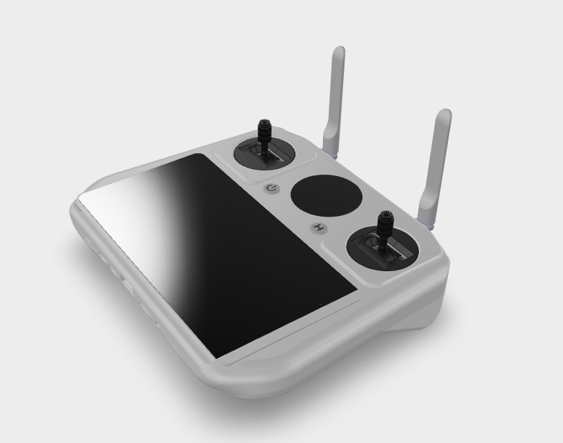
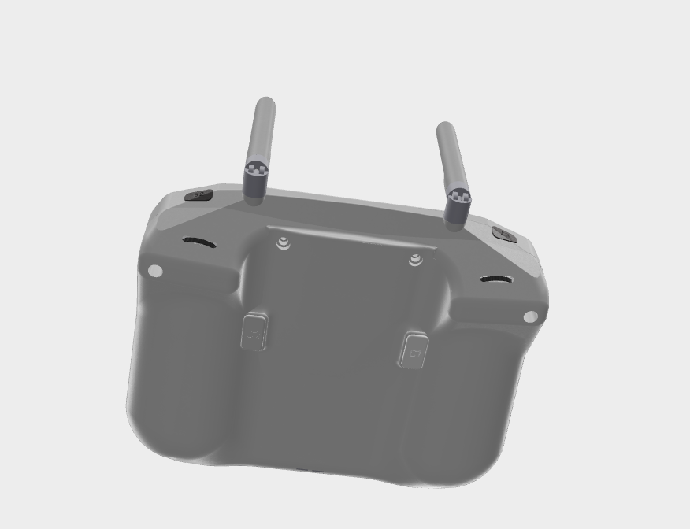

本项目设计之初，用于多功能用途，涵盖无人机、遥控车、机器人、掌机游戏等领域。硬件设计包括支持拓展接口接入 4G 模块，用于实现远程通讯功能。

## ✨ 项目特色


*   **强大的双芯架构**：采用瑞芯微 RK3566（四核 Cortex-A55）作为主处理器，负责 UI、逻辑和数据处理；乐鑫 ESP32-S3 负责高速、低延迟的遥控信号传输与接收，专芯专用，性能强悍。

*   **3D 预览链接**：[https://app.shapr3d.com](https://app.shapr3d.com/v/82T613zoKbYPhhB1KprAA)[/v/8](https://app.shapr3d.com/v/82T613zoKbYPhhB1KprAA)[2T613](https://app.shapr3d.com/v/82T613zoKbYPhhB1KprAA)[zoKbY](https://app.shapr3d.com/v/82T613zoKbYPhhB1KprAA)[PhhB](https://app.shapr3d.com/v/82T613zoKbYPhhB1KprAA)[1KprA](https://app.shapr3d.com/v/82T613zoKbYPhhB1KprAA)[A](https://app.shapr3d.com/v/82T613zoKbYPhhB1KprAA)

*   **完全开源**：硬件（PCB & 3D 模型）、软件固件均完全开源，遵循相关开源协议。你可以自由地修改、分发和制造。

*   **高刷新率显示**：RK3566 轻松驱动高分辨率屏幕，为 QGroundControl、MissionPlanner 等地面站软件提供流畅的视觉体验。

*   **极低通信延迟**：ESP32-S3 通过 ESP-NOW、与 E32-400M30S 模块通信或自定义协议与无人机端接收机通信，实现近乎实时的操控响应。

*   **人体工学设计**：精心设计的 3D 打印外壳，提供舒适握持感和便捷的操控布局。

*   **丰富的扩展接口**：预留 USB、串口、GPIO 等接口，方便连接模块、调试和功能二次开发。







## 🛠️ 硬件概览 (Hardware Overview)

 6寸屏幕https://oshwhub.com/sakuraneko/tai-shan-pai-6-cun-ping-mu-zhuan-jie-ban


| 组件     | 型号 / 描述                                                             |
| ------ | ------------------------------------------------------------------- |
| 主核心板   | Rockchip RK3566 (4GB RAM + 32GB eMMC) ROCK3(CM3)                              |
| 主核心板   | Rockchip RK3566 (4GB RAM + 32GB eMMC)                               |
| 无线协处理器 | ESP32-S3 (搭载 Wi-Fi 2.4GHz & Bluetooth 5.0)                          |
| 射频模块   | E32-400M30S（433MHz 频段，支持远距离通信）                                      |
| 通信协议   | ESP-NOW, LoRa (需外接模块), E32-400M30S 与 ESP32-S3 通过 UART 接口通信，或自定义透传协议 |
| 显示屏幕   | 6 英寸 IPS LCD (1280X720) 1.28 寸 tft                                  |
| 操控输入   | 双霍尔摇杆，多功能拨轮，按键，开关                                                   |
| 电池     | 4000mAh 2S Li-ion 电池组，支持 PD 快充                                      |
| 连接性    | USB-C, 3.5mm 耳机孔，TF 卡槽 HDMI                                         |

详细的硬件文档、PCB 设计文件（KiCad）和 3D 模型请见 /hardware 目录。

## 🚀 软件架构 (Software Architecture)

项目的软件部分等待您的贡献！我们设想的结构如下：


```
firmware/   固件/

├── opc\_linux\_os/        # 基于Buildroot或Debian的系统镜像构建脚本

├── opc\_main\_ui/         # 基于Qt或Flutter的主界面应用程序

├── opc\_esp32\_s3/        # ESP32-S3固件（Arduino/ESP-IDF框架，包含与E32-400M30S模块的通信驱动）

└── docs/                # 详细的构建和烧录指南
```


*   **RK3566 (Linux 侧)**：运行一个轻量级 Linux 系统。主程序负责：


    *   显示用户界面（UI）。

    *   运行地面站软件（如 QGC）。

    *   处理摇杆、按键输入。

    *   通过 UART 与 ESP32-S3 通信，发送控制指令和接收遥测数据。

*   **ESP32-S3 (射频侧)**：作为透明的 “调制解调器”。


    *   通过 SPI/UART 从 RK3566 接收控制数据。

    *   与 E32-400M30S 模块进行数据交互，将控制数据通过该射频模块发送出去，并接收来自该模块的遥测数据。

    *   使用 ESP-NOW（首选）或 Wi-Fi 将数据高效地发送到无人机端的接收机。

    *   接收无人机传回的遥测数据并转发给 RK3566。

## ⚡ 快速开始 (Getting Started)

注意：本项目软件部分正处于前期开发阶段，热烈欢迎社区贡献！

### prerequisites   # # #先决条件


*   一台安装了 Linux 的电脑（Ubuntu 推荐）

*   RK3566 的烧录工具（RKDevTool）

*   ESP32-S3 的开发环境（Arduino IDE 或 ESP-IDF）

*   E32-400M30S 模块相关的开发资料和驱动支持

*   一台自己组装好的 OPC 遥控器硬件

### 构建和烧录 (Build & Flash)

（此部分需要后续由开发者共同完善）


1.  构建 Linux 系统镜像：进入 firmware/opc\_linux\_os，根据文档使用 Buildroot 构建系统。

2.  烧录 RK3566：使用 RKDevTool 将镜像烧录至核心板。

3.  编译 ESP32 固件：进入 firmware/opc\_esp32\_s3，使用 PlatformIO 或 Arduino IDE 编译包含 E32-400M30S 通信驱动的固件并烧录。

4.  编译主 UI 程序：进入 firmware/opc\_main\_ui，按照 Qt/Flutter 指南交叉编译应用程序。

详细的步骤将在文档完善后提供。

## 🤝 如何贡献 (Contributing)

我们坚信开源的力量，并热烈欢迎任何形式的贡献！


*   👀 发现 Bug？ 请在 Issue 中提出。

*   💡 有好的想法？ 提交 Feature Request 的 Issue 或直接参与讨论。

*   📝 想写代码？ 请 Fork 本仓库，修改后提交 Pull Request。请遵循现有的代码风格。

*   🌍 翻译文档：帮助我们将项目翻译成更多语言。

*   📢 分享扩散：告诉更多的无人机机器人和开源硬件爱好者！


